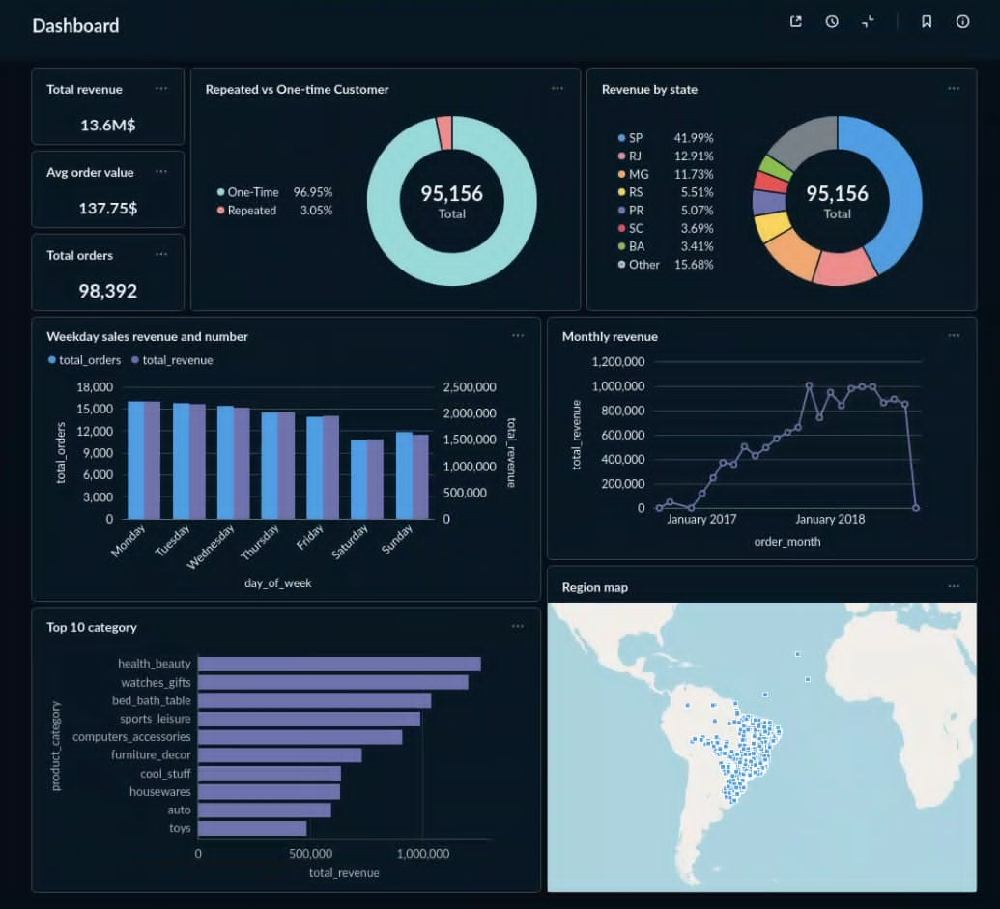

# E-Commerce Business Intelligence (BI) Project

A complete, end-to-end **Business Intelligence pipeline** built on the Brazilian **Olist e-commerce dataset**. This project covers every stage of a modern BI workflow — from raw data extraction, through star-schema transformation, to an interactive Metabase dashboard — all containerized with Docker.

---

## Dashboard Preview



---

## Table of Contents

- [Project Overview](#project-overview)
- [Architecture](#architecture)
- [Dataset](#dataset)
- [Data Warehouse Schema (Star Schema)](#data-warehouse-schema-star-schema)
- [ETL Pipeline](#etl-pipeline)
- [Analytical Queries](#analytical-queries)
- [Dashboard](#dashboard)
- [Tech Stack](#tech-stack)
- [Project Structure](#project-structure)
- [Getting Started](#getting-started)
  - [Prerequisites](#prerequisites)
  - [Setup & Run](#setup--run)
- [Default Credentials](#default-credentials)
- [License](#license)

---

## Project Overview

This project answers key business questions for an e-commerce company using a fully automated data pipeline:

| # | Business Question |
|---|---|
| 1 | What is the overall Average Order Value (AOV)? |
| 2 | How does monthly revenue trend over time? |
| 3 | Where are customers located geographically? |
| 4 | What is the ratio of one-time vs. repeat customers? |
| 5 | Which are the top 10 product categories by revenue? |
| 6 | What is the total number of orders placed? |
| 7 | What is the total revenue generated? |
| 8 | How do sales volume and revenue vary by day of the week? |
| 9 | Which states generate the most revenue and unique customers? |

---

## Architecture

```
Raw CSV Files (Olist Dataset)
        │
        ▼
┌──────────────────┐
│  ETL Pipeline    │  ← etl_pipeline.py (Python / Pandas)
│  Extract         │
│  Transform       │
│  Load            │
└────────┬─────────┘
         │
         ▼
┌──────────────────────────────────┐
│  PostgreSQL Data Warehouse       │  ← Docker container (bi_dw)
│  Star Schema                     │
│  • dim_customer                  │
│  • dim_region                    │
│  • dim_item                      │
│  • dim_order_time                │
│  • fact_order_item  (Fact Table) │
└────────┬─────────────────────────┘
         │
         ▼
┌──────────────────┐
│  Metabase        │  ← Docker container (port 3000)
│  Dashboard       │
└──────────────────┘
```

---

## Dataset

The raw data is sourced from the publicly available [Brazilian E-Commerce Public Dataset by Olist](https://www.kaggle.com/datasets/olistbr/brazilian-ecommerce) (Kaggle). It represents ~100,000 orders placed between 2016 and 2018.

| File | Description |
|---|---|
| `olist_orders_dataset.csv` | Order-level data (status, timestamps) |
| `olist_order_items_dataset.csv` | Line-item data per order (product, price, freight) |
| `olist_customers_dataset.csv` | Customer info (ID, city, state, zip) |
| `olist_geolocation_dataset.csv` | Zip code–level lat/lon coordinates |
| `olist_products_dataset.csv` | Product metadata (category, weight, dimensions) |
| `olist_order_payments_dataset.csv` | Payment type and installment details |
| `olist_order_reviews_dataset.csv` | Customer review scores and comments |
| `olist_sellers_dataset.csv` | Seller info (city, state, zip) |
| `product_category_name_translation.csv` | Portuguese → English category name mapping |

> **Note:** All raw CSV files live in the `Raw_data/` directory and are excluded from version control via `.gitignore`.

---

## Data Warehouse Schema (Star Schema)

The data warehouse uses a **Star Schema** design for optimal query performance and analytical simplicity.

```
                        ┌───────────────────┐
                        │  dim_order_time   │
                        │─────────────────  │
                        │ PK: time_key      │
                        │ full_date         │
                        │ year              │
                        │ quarter           │
                        │ month_number      │
                        │ month_name        │
                        │ day_of_week       │
                        └────────┬──────────┘
                                 │
┌──────────────────┐    ┌────────┴──────────────┐    ┌──────────────────┐
│   dim_customer   │    │   fact_order_item     │    │    dim_item      │
│────────────────  │    │───────────────────    │    │────────────────  │
│ PK: customer_key │◄───│ PK: sales_key (SERIAL)│───►│ PK: item_key    │
│ state            │    │ order_id (deg. dim.)  │    │ category         │
│ city             │    │ FK: item_key          │    │ weight           │
└──────────────────┘    │ FK: customer_key      │    │ volume           │
                        │ FK: region_key        │    │ name_length      │
┌──────────────────┐    │ FK: time_key          │    │ description_len  │
│   dim_region     │    │ price                 │    └──────────────────┘
│────────────────  │    │ freight_value         │
│ PK: region_key   │◄───│                       │
│ city             │    └───────────────────────┘
│ state            │
│ latitude         │
│ longitude        │
└──────────────────┘
```

> `order_id` is kept in the fact table as a **degenerate dimension** — it carries analytical value (distinguishing orders) but has no separate dimension table.

---

## ETL Pipeline

The pipeline ([`etl_pipeline.py`](./etl_pipeline.py)) follows a classic **Extract → Transform → Load** pattern:

### 1. Extract
Reads all 6 relevant CSV files from `Raw_data/` into Pandas DataFrames.

### 2. Transform

| Dimension | Transformation Logic |
|---|---|
| `dim_customer` | Deduplicate on `customer_unique_id`; extract state & city |
| `dim_region` | Group by zip code prefix; average lat/lon; take first city/state |
| `dim_item` | Join products with English category translations; compute volume (L × H × W) |
| `dim_order_time` | Parse `order_purchase_timestamp`; extract year, quarter, month, day-of-week |
| `fact_order_item` | Join items ↔ orders ↔ customers; derive `time_key`; enforce referential integrity |

**Data Quality Step:** Before loading, foreign keys in the fact table are validated against all dimension tables to drop any orphaned records.

### 3. Load
Tables are loaded to PostgreSQL in dependency order:
1. All four dimension tables first (no FK dependencies)
2. `fact_order_item` last (depends on all four dimensions)

Uses `if_exists='append'` to safely add data without dropping existing tables.

---

## Analytical Queries

The file [`question.sql`](./question.sql) contains **9 production-ready analytical queries** that power the Metabase dashboard:

| # | Query | Purpose |
|---|---|---|
| 1 | Average Order Value | Single KPI scalar — total revenue ÷ distinct orders |
| 2 | Monthly Revenue | Time-series line chart of revenue per month |
| 3 | Region Map | Geographic dot-map of sales density by zip-code lat/lon |
| 4 | Repeat vs. One-Time Customers | Donut chart segmenting customers by purchase frequency |
| 5 | Top 10 Category by Revenue | Bar chart of the 10 highest-earning product categories |
| 6 | Total Orders | Single KPI scalar — count of distinct orders |
| 7 | Total Revenue | Single KPI scalar — sum of all item prices |
| 8 | Weekday Sales | Bar chart of orders and revenue broken down by day of week |
| 9 | Revenue by State | Table ranking Brazilian states by unique customers and revenue |

```sql
-- 1. Average Order Value (AOV)
SELECT SUM(price) / COUNT(DISTINCT order_id) AS "AOV"
FROM fact_order_item;

-- 2. Monthly Revenue Trend
SELECT DATE_TRUNC('month', d.full_date) AS order_month, SUM(f.price) AS total_revenue
FROM fact_order_item f JOIN dim_order_time d ON f.time_key = d.time_key
GROUP BY 1 ORDER BY 1;

-- 3. Geographic Sales Density (Region Map)
SELECT r.latitude, r.longitude, r.state, COUNT(f.sales_key) AS total_items_sold
FROM fact_order_item f JOIN dim_region r ON f.region_key = r.region_key
GROUP BY 1, 2, 3;

-- 4. One-Time vs. Repeat Customers
WITH CustomerOrderCounts AS (
  SELECT customer_key, COUNT(DISTINCT order_id) AS total_orders
  FROM fact_order_item GROUP BY 1
)
SELECT CASE WHEN total_orders = 1 THEN 'One-Time Customer' ELSE 'Repeat Customer' END
            AS customer_type,
       COUNT(customer_key) AS total_customers
FROM CustomerOrderCounts GROUP BY 1;

-- 5. Top 10 Product Categories by Revenue
SELECT i.category AS product_category, SUM(f.price) AS total_revenue
FROM fact_order_item f JOIN dim_item i ON f.item_key = i.item_key
WHERE i.category IS NOT NULL
GROUP BY i.category ORDER BY total_revenue DESC LIMIT 10;

-- 6. Total Orders
SELECT COUNT(DISTINCT order_id) AS "Total Orders"
FROM fact_order_item;

-- 7. Total Revenue
SELECT SUM(price) AS "Total Revenue"
FROM fact_order_item;

-- 8. Sales by Day of Week
SELECT t.day_of_week, COUNT(DISTINCT f.order_id) AS total_orders, SUM(f.price) AS total_revenue
FROM fact_order_item f JOIN dim_order_time t ON f.time_key = t.time_key
GROUP BY t.day_of_week
ORDER BY CASE t.day_of_week
    WHEN 'Monday' THEN 1 WHEN 'Tuesday' THEN 2 WHEN 'Wednesday' THEN 3
    WHEN 'Thursday' THEN 4 WHEN 'Friday' THEN 5 WHEN 'Saturday' THEN 6 WHEN 'Sunday' THEN 7
END;

-- 9. Revenue and Customers by State
SELECT c.state, COUNT(DISTINCT f.customer_key) AS total_unique_customers, SUM(f.price) AS total_revenue
FROM fact_order_item f JOIN dim_customer c ON f.customer_key = c.customer_key
GROUP BY c.state ORDER BY total_revenue DESC;
```

---

## Dashboard

The Metabase dashboard (accessible at `http://localhost:3000`) contains **9 queries** surfaced across multiple panels:

| Panel | Chart Type | Powered By | Insight |
|---|---|---|---|
| **Average Order Value** | Scalar / KPI card | Query 1 | Single headline metric showing the average spend per order |
| **Monthly Revenue** | Line chart | Query 2 | Revenue grew from ~$200K/month (Jan 2017) to a peak of ~$1.1M/month (late 2017), then drops off at the dataset boundary |
| **Region Map** | Geographic dot-map | Query 3 | Sales are heavily concentrated in south-eastern Brazil (SP, RJ, MG states) |
| **Repeated vs One-Time Customers** | Donut chart | Query 4 | **96.95%** of 95,156 customers are one-time buyers; only **3.05%** are repeat purchasers |
| **Top 10 Categories by Revenue** | Bar chart | Query 5 | Ranking of the 10 highest-grossing product categories (e.g. health & beauty, watches & gifts) |
| **Total Orders** | Scalar / KPI card | Query 6 | Single headline count of all distinct orders in the dataset |
| **Total Revenue** | Scalar / KPI card | Query 7 | Single headline sum of all item prices across the dataset |
| **Sales by Day of Week** | Bar chart | Query 8 | Identifies which weekdays drive the highest order volume and revenue |
| **Revenue by State** | Table | Query 9 | Ranks Brazilian states by total unique customers and total revenue generated |

---

## Tech Stack

| Layer | Technology |
|---|---|
| **Data Storage (Raw)** | CSV files (Olist public dataset) |
| **ETL / Transformation** | Python 3, Pandas 2.2.2 |
| **Database Connector** | SQLAlchemy 2.0.30, psycopg2-binary 2.9.9 |
| **Data Warehouse** | PostgreSQL 15 |
| **Visualization / BI** | Metabase (latest) |
| **Containerization** | Docker & Docker Compose |

---

## Project Structure

```
E-Commerce-Business-Intelligence/
│
├── Raw_data/                          # Raw CSV source files (not tracked in git)
│   ├── olist_orders_dataset.csv
│   ├── olist_order_items_dataset.csv
│   ├── olist_customers_dataset.csv
│   ├── olist_geolocation_dataset.csv
│   ├── olist_products_dataset.csv
│   ├── olist_order_payments_dataset.csv
│   ├── olist_order_reviews_dataset.csv
│   ├── olist_sellers_dataset.csv
│   └── product_category_name_translation.csv
│
├── Report/
│   └── Report.docx                    # Full written project report
│
├── etl_pipeline.py                    # Main ETL script (Extract, Transform, Load)
├── init.sql                           # PostgreSQL DDL — creates all tables
├── question.sql                       # 9 analytical SQL queries for the dashboard
├── docker-compose.yml                 # Spins up PostgreSQL + Metabase
├── requirements.txt                   # Python dependencies
├── dashboard.png                      # Screenshot of the final Metabase dashboard
├── Bài tập lớn Business Intelligence.docx  # Original assignment brief (Vietnamese)
└── README.md
```

---

## Getting Started

### Prerequisites

Make sure you have the following installed:

- [Docker Desktop](https://www.docker.com/products/docker-desktop/) (includes Docker Compose)
- [Python 3.10+](https://www.python.org/downloads/)
- The Olist raw CSV files placed inside the `Raw_data/` directory

### Setup & Run

#### Step 1 — Clone the repository
```bash
git clone <your-repo-url>
cd E-Commerce-Business-Intelligence
```

#### Step 2 — Download the raw data
Download the Olist dataset from [Kaggle](https://www.kaggle.com/datasets/olistbr/brazilian-ecommerce) and place all CSV files into the `Raw_data/` directory.

#### Step 3 — Start the Docker services
This command launches both **PostgreSQL** and **Metabase**:
```bash
docker-compose up -d
```

Wait ~30 seconds for the containers to fully initialize.

#### Step 4 — Initialize the database schema
Connect to the PostgreSQL container and run the DDL script:
```bash
docker exec -i bi_dw psql -U admin -d ecom_dw < init.sql
```

#### Step 5 — Install Python dependencies
```bash
pip install -r requirements.txt
```

#### Step 6 — Run the ETL pipeline
```bash
python etl_pipeline.py
```

Expected output:
```
Starting ETL Pipeline
Extracting data from CSVs...
Transforming data into Star Schema...
Loading data into PostgreSQL...
   ✅ dim_customer loaded.
   ✅ dim_region loaded.
   ✅ dim_item loaded.
   ✅ dim_order_time loaded.
   ✅ fact_order_item loaded.
ETL Pipeline Complete!
```

#### Step 7 — Open Metabase and connect the database
1. Navigate to **http://localhost:3000** in your browser
2. Complete the Metabase onboarding wizard
3. When prompted to add a database, use these settings:
   - **Type:** PostgreSQL
   - **Host:** `postgres` (the Docker service name)
   - **Port:** `5432`
   - **Database name:** `ecom_dw`
   - **Username:** `admin`
   - **Password:** `admin`
4. Create a new dashboard and add questions using the queries in [`question.sql`](./question.sql)

---

## Default Credentials

| Service | URL | Username | Password |
|---|---|---|---|
| PostgreSQL | `localhost:5432` | `admin` | `admin` |
| Metabase | `http://localhost:3000` | *(set during setup)* | *(set during setup)* |

---

##  License

This project uses the [Olist public dataset](https://www.kaggle.com/datasets/olistbr/brazilian-ecommerce) which is licensed under [CC BY-NC-SA 4.0](https://creativecommons.org/licenses/by-nc-sa/4.0/). This project is intended for educational purposes.